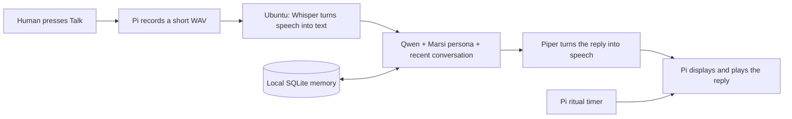

# Bring Marsi's tiny forge to life

We are building a local character companion around an existing Qwen model.
We do not need to train a new LLM. Marsi's character comes from a written persona,
conversation context, a small memory store, and his display's behaviour.
He can feel lively and familiar without being conscious.

This starter implementation extends the existing repository. The original
template/Zulip bot still runs independently. The new local companion does not
connect to Zulip or send messages to other people.

## Your machines

| Machine | Job | Initial choice |
| --- | --- | --- |
| Ubuntu, i5-4460, 8 GB DDR3, Intel HD, 1 TB HDD | Qwen, speech recognition, voice synthesis, memory | CPU inference; Qwen3 1.7B, Whisper tiny, Piper |
| Raspberry Pi 3 B+, 1 GB RAM | Display, microphone recording, speaker playback | Raspberry Pi OS Lite 64-bit, minimal X11, Tkinter |

The Qwen3 1.7B Ollama download is about 1.4 GB. Runtime memory includes much more
than model weights: the operating system, conversation context, and speech engines
also need room. This is a conservative starting choice, not a measured speed promise.
Expect pauses; measure on the server before trying a larger model. The Intel HD GPU
is not part of our acceleration plan. The Pi does not load neural models.

You also need a speaker or headphones: a display and microphone alone cannot
produce a spoken reply. A USB audio device or HDMI audio is a practical starting point.

## What happens when you talk

Whisper is the ear, Qwen is the conversation engine, Piper is the voice, and the
Pi is the little body. Ollama is the program that loads and runs Qwen. SQLite is
a small database file for conversation history and notes.

## Build in this order

1. **Ubuntu text conversation.** Follow [Ubuntu setup](ubuntu-server.md). Get one
   useful Qwen response before adding speech or the Pi.
2. **Server speech.** Download the small recognizer and a Piper voice; validate
   them once while internet access is available.
3. **Pi display and typed chat.** Follow [Pi setup](raspberry-pi.md). Confirm the
   address and shared token, then type a message.
4. **Push-to-talk.** Verify the microphone and speaker. Press Talk, speak, and
   press Finish. There is a 15-second recording limit.
5. **Leave the forge running.** Enable the Ubuntu user service and, after audio
   works, optionally start the Pi display at boot.

Marsi performs a small visual ritual every 10–20 minutes when idle. Rituals are
silent by default, skip 22:00–08:00 in the Pi's local time, and defer while you
are interacting. They use short authored lines, so they do not wake Qwen or
depend on the network. Restarting the Pi starts a fresh ritual countdown.

## What this prototype includes

- Qwen conversation through Ollama with short responses and thinking disabled.
- Optional CPU-only Whisper and Piper, loaded on first use and reused.
- Persistent recent conversation and explicit notes, with a Forget operation.
- A lightweight animated red-robed tech-priest, typing, and push-to-talk.
- A shared token for LAN access; one inference/speech task at a time.
- Setup scripts, a server startup service, and automated regression tests.

The starter does not yet include a wake word, continuous listening, self-editing
code, device control, image generation, or knowledge search. Qwen can help describe
chibi scenes and write art prompts. Actual generated artwork belongs in a later,
optional image pipeline, likely on better hardware or an explicitly chosen service.

## Develop from either machine

GitHub holds shared code; each machine keeps its own settings and secrets.
Use the same feature branch on both machines. After making a change, commit and
push it; on the other machine, pull and restart its application. Models, tokens,
recordings and memory files are excluded from Git.

[Development and handoff notes](development.md) explain the code and contain a
ready-to-use prompt for continuing development on Ubuntu.

## Sources and personality

Marsi's persona follows the owner's description and the repository's existing
`phrases.json`: cute, tiny, devoted to the Machine God of Mars, proud of the
Adeptus Mechanicus, warm toward humanity, and fond of tiny machine blessings.
The shared ChatGPT background link could not be read during this setup, so its
contents have not been incorporated or invented.

Official references: [Qwen3 1.7B](https://ollama.com/library/qwen3:1.7b),
[Ollama chat API](https://docs.ollama.com/api/chat),
[faster-whisper](https://github.com/SYSTRAN/faster-whisper),
[Piper](https://github.com/OHF-Voice/piper1-gpl), and
[Raspberry Pi OS](https://www.raspberrypi.com/software/operating-systems/).
